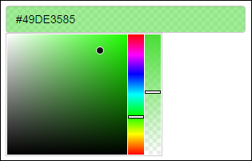

# {colourpicker} - A Colour Picker Tool for Shiny and for Selecting Colours in Plots

> [Demo](https://daattali.com/shiny/colourInput/) &middot; Created by [Dean Attali](https://deanattali.com)

{colourpicker} gives you a colour picker widget that can be used in different contexts in R.

The most common uses of {colourpicker} are to use the `colourInput()` function to create a [colour input in Shiny](https://daattali.com/shiny/colourInput/), or to use the `plotHelper()` function/RStudio Addin to easily [select colours for a plot](inst/img/plothelper-demo.gif).

